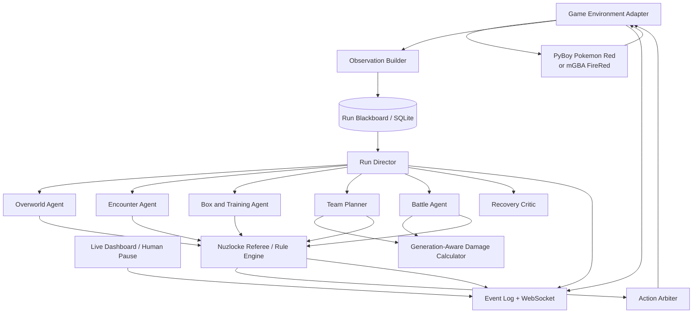

> **Historical design proposal.** For implemented behavior and commands, use [README.md](README.md) and [AGENTS.md](AGENTS.md); measured results are in [docs/validation.md](docs/validation.md). The current runner uses three systems and targets Brock. Separate specialist agents, a damage-calculation service, and FireRed below describe future scope.

# Realistic Multi-Agent Nuzlocke Runner

**Status:** Historical architecture and weekend MVP proposal
**Primary MVP:** Pokemon Red  
**Target port:** Pokemon FireRed  
**Inference:** Existing local Qwen 3.6 endpoint on four RTX 3090 GPUs

---

## 1. Executive recommendation

Build the first complete run on **Pokemon Red**, using the headless API and live dashboard from `NousResearch/pokemon-agent`. Preserve a strict `GameEnvironment` interface so the same agents can later run FireRed through an mGBA/Lua adapter.

This is the pragmatic split:

- `pokemon-agent` already exposes structured state, screenshots, button actions, save states, WebSockets, and a watchable dashboard. Its Red/Blue support is marked complete.
- Its FireRed support is currently marked **Phase 2**, and the repository explicitly lists a full FireRed memory reader with decryption as unfinished work.
- mGBA's scripting layer exposes memory, buttons, screenshots, save states, frame stepping, and callbacks, making it a strong future FireRed control bridge with a normal visible emulator window.

The weekend goal should not be “beat the entire game.” It should be:

> Complete a legally valid autonomous Nuzlocke segment from a new game through Brock, with encounters, permanent deaths, level caps, team selection, battle calculations, crash recovery, and a live human-readable dashboard.

A stretch goal is reaching Misty.

---

## 2. The central design decision: realistic but instrumented

“Realistic” should mean the agent plays by button presses and does not exploit hidden game state. It does **not** need to mean forcing a text-only model to infer every menu pixel.

Use three observation layers:

### A. Player observation layer

Information gameplay agents may use:

- Current screenshot.
- Player position and map name.
- Party species, nicknames, levels, visible HP, statuses, and known moves.
- Bag contents that could be inspected in the menu.
- Current dialog text.
- Opponent species and level once shown.
- Previously observed trainer and encounter information stored in run memory.
- A collision grid for navigation, if running in “human-assist” mode.

### B. Privileged referee layer

Information only deterministic validators may use:

- Raw RAM needed to detect a faint, encounter, map transition, badge, blackout, or inventory mutation.
- Emulator frame count and save-state hashes.
- Hidden identifiers needed to distinguish Pokemon reliably.

This layer may enforce rules but must never reveal RNG state, unseen opponent stats, future encounters, hidden IVs, or AI choices to the gameplay agents.

### C. Debug layer

Full RAM, save/load controls, and replay tools. Disabled for scored runs except crash recovery.

Provide a run setting:

```yaml
observation_mode: human_assist  # strict_visual | human_assist | debug
```

For the weekend, use `human_assist`. Later, compare against `strict_visual` as a benchmark.

---

## 3. Do not make four agents press buttons

The game is a sequential environment. Multiple autonomous agents acting concurrently will create race conditions, contradictory menu inputs, and irreproducible runs.

Use the four GPUs to host one strong Qwen endpoint, not four independent game controllers. Instantiate agents as **role-scoped calls** to the same model. Parallelism is useful only for read-only work such as evaluating candidate teams or calculating several battle lines.

The architecture must enforce:

1. Exactly one active task owner.
2. Exactly one action writer.
3. Every proposed action passes through a deterministic rule guard.
4. Agent outputs are structured JSON, not free-form button spam.

---

## 4. Proposed architecture



### Deterministic components

These are services, not LLM agents:

- **Game Environment Adapter:** observations, screenshots, button execution, pause, save, and crash restore.
- **Observation Builder:** converts raw emulator state into allowed player observations.
- **Nuzlocke Referee:** authoritative encounter ledger, death ledger, cap enforcement, and run validity.
- **Action Arbiter:** the only process allowed to send inputs.
- **Damage Calculator Service:** wraps `@smogon/calc` with the selected generation.
- **Event Store:** append-only SQLite/JSONL record of every observation, proposal, validation, action, and outcome.

### LLM roles

Use six role prompts, but only call the role needed by the current game mode.

---

## 5. Agent roster

## 5.1 Run Director

The Run Director owns long-horizon progress but never presses buttons.

Responsibilities:

- Maintain the current milestone and next objective.
- Route control based on game mode: overworld, encounter, battle, box, recovery.
- Decide when a gym preparation cycle begins.
- Request a team plan before mandatory boss battles.
- Track unresolved obligations such as “box the fainted Rattata” or “nickname the Route 2 encounter.”
- Stop the run when the rules engine reports a wipe or invalid state.

It consumes a compact run summary, not the full transcript.

## 5.2 Overworld Agent

Responsibilities:

- Navigate toward a named local objective.
- Interact with NPCs, doors, menus, and story objects.
- Avoid optional grass until the Encounter Agent confirms whether the area encounter is available.
- Stop immediately on battle start, map ambiguity, unexpected dialog, or a stuck signal.
- Return control after a bounded action macro, typically 1-8 inputs.

It should not choose battle moves, team composition, or rare-candy usage.

## 5.3 Encounter Agent

This is an important addition to the proposed roster.

Responsibilities:

- Decide whether the current wild Pokemon is the legal encounter for the area.
- Apply first-encounter, duplicates, species, shiny, gift, and static encounter clauses.
- Select capture tactics that minimize death and accidental knockout risk.
- Choose a nickname from a configured naming policy.
- Commit the encounter outcome to the immutable ledger.

The Battle Agent may execute capture turns, but the Encounter Agent owns the policy.

## 5.4 Box and Training Agent

Responsibilities:

- Maintain the living roster, dead box, active party, HM utility needs, and reserve depth.
- Execute approved party and PC changes through normal menus.
- Request rare-candy leveling only at safe points and only to an explicit target level.
- Never exceed the current cap.
- Ensure fainted Pokemon are moved to the dead box before further progression.
- Protect scarce TMs and evolution items according to Team Planner reservations.

Rare candies should be injected as inventory, not used to write levels directly. All candy use should occur through the normal item menu and be event-logged.

## 5.5 Team Planner

Responsibilities:

- Build the six-Pokemon team for the next major battle.
- Consider typing, current moves, speed order, expected damage ranges, status risk, sacrifice policy, and future value.
- Ask the Box Agent what is available and legal.
- Call the calculator across candidate leads and switch lines.
- Produce a battle dossier with a primary line, contingencies, and hard abort thresholds.

Example output:

```json
{
  "battle_id": "brock_pewter",
  "lead": "SHELLY",
  "party_order": ["SHELLY", "BIRDIE", "SPROUT", "NIBBLES"],
  "target_levels": {"SHELLY": 14, "BIRDIE": 12, "SPROUT": 13},
  "opening_plan": ["Bubble", "Bubble"],
  "switch_rules": [
    "If SHELLY is below 55% HP before Onix acts, switch to SPROUT",
    "Never expose BIRDIE to Rock Tomb"
  ],
  "risk_budget": "No intentional sacrifices"
}
```

## 5.6 Battle Agent

Responsibilities:

- Execute one battle turn at a time.
- Parse the current battle state.
- Compare legal moves and switches with the pre-battle dossier.
- Call the calculator when the state differs materially from the plan.
- Use conservative damage ranges, not average damage.
- Prefer survival and run preservation over speed.
- Immediately emit a `pokemon_fainted` event when detected.
- Yield to Encounter Agent in legal capture battles.

It may not silently invent opponent moves or exact stats. Unknowns must be represented as ranges.

## 5.7 Recovery Critic

Responsibilities:

- Detect repeated positions, oscillating menus, unchanged screenshots, dialog loops, and failed transitions.
- Diagnose whether the failure is navigation, menu state, stale observation, emulator pause, or plan error.
- Recommend the smallest safe recovery action.
- Escalate to human pause after a configurable number of failed recoveries.

This is a critic, not a second controller. Its recovery proposal still passes through the arbiter.

---

## 6. Communication model

Use a blackboard plus typed task envelopes rather than agents chatting freely.

### Task envelope

```json
{
  "task_id": "task-0042",
  "owner": "overworld",
  "objective": "Reach the Pewter Pokemon Center entrance",
  "context_refs": ["state:991", "map:pewter_city", "ledger:run-1"],
  "allowed_tools": ["observe", "propose_actions"],
  "constraints": [
    "Do not enter grass",
    "Stop on battle start",
    "Maximum 8 button actions"
  ],
  "success": ["map == PEWTER_CITY", "position in center_entrance_tiles"],
  "abort": ["battle_started", "stuck_score >= 3", "unexpected_map"]
}
```

### Action proposal

```json
{
  "task_id": "task-0042",
  "agent": "overworld",
  "reason": "The center door is two tiles north and one tile east.",
  "actions": ["walk_up", "walk_up", "walk_right", "press_a"],
  "expected": ["position changes north twice", "map transition to Pokemon Center"],
  "risk": "low"
}
```

### Arbiter result

```json
{
  "proposal_id": "proposal-0199",
  "status": "approved",
  "executed_actions": ["walk_up", "walk_up"],
  "stopped_early_because": "dialog_started",
  "result_state_ref": "state:992"
}
```

Actions should be executed incrementally with observation checkpoints. Do not send long macros through uncertain menus.

---

## 7. Authoritative run state

Store run state in SQLite with an append-only event log and materialized views.

Core entities:

- `run`: game, ROM hash, ruleset hash, seed metadata, start time, status.
- `pokemon`: stable internal ID, nickname, species, origin area, encounter number, status.
- `encounter_ledger`: area, first eligible encounter, outcome, clause used.
- `death_ledger`: Pokemon ID, battle, opponent, move if known, frame, state hash.
- `cap_state`: current milestone, current cap, next cap.
- `inventory_reservations`: TM, evolution item, healing and ball budgets.
- `objectives`: current milestone, active task, queued obligations.
- `events`: append-only agent and environment events.
- `checkpoints`: crash-recovery states and integrity hashes.

The Nuzlocke Referee is the only writer for encounter, death, and cap ledgers.

---

## 8. Rules engine

Make the rules explicit YAML, not prompt prose. Defaults are included in `config/`.

Recommended MVP rules:

- Faint equals permanent death.
- Only the first eligible encounter per named area may be captured.
- Encounters before obtaining Poke Balls do not count.
- Duplicates clause enabled.
- Species clause enabled.
- Shiny clause enabled but shiny Pokemon cannot replace the area's legal encounter.
- Nicknames required.
- Set battle style.
- No items during trainer battles; Poke Balls remain allowed in wild encounters.
- No overleveling past the next boss's highest-level Pokemon.
- Rare candies allowed only outside battle and only up to the cap.
- No save-state rollback for bad outcomes.
- Save states are crash recovery only.
- A blackout ends the run unless a specific continuation clause is enabled.

### Rule enforcement examples

Before any trainer battle:

```text
assert all(active_party.level <= current_cap)
assert all(active_party.status != DEAD)
assert no unresolved_dead_party_members
```

On battle faint:

```text
record death immediately
mark Pokemon unavailable
allow battle to continue if living party remains
queue mandatory box operation after battle
```

On first encounter:

```text
freeze area encounter eligibility
resolve duplicate/species clauses
commit the first eligible species before capture actions
record caught, fainted, fled, or failed
never retry the area after a failed legal encounter
```

### Rare-candy integrity

- Inject a bounded candy inventory through an audited environment operation.
- Never directly mutate Pokemon experience or level.
- Compute `candies_needed = target_level - current_level`.
- Validate the target against the current cap before every use.
- Re-observe after every candy or short batch.
- Stop before an evolution or move-learning dialog and hand control to a menu decision routine.

---

## 9. Battle planning and calculations

Wrap `@smogon/calc` as a local HTTP or subprocess service and pin the generation:

- Pokemon Red: Generation 1.
- Pokemon FireRed: Generation 3.

The calculator should return full damage rolls, min/max percentage, knockout probabilities, speed order assumptions, recoil, and relevant field effects.

Do not give the calculator hidden IVs or exact enemy stats unless they are deterministically known for that trainer. Use conservative assumptions:

- Known fixed trainer level and species.
- Known or documented trainer moves when the chosen realism policy permits external game knowledge.
- Stat ranges when DVs/IVs are not visible.
- Worst relevant damage roll for survival checks.

### Two planning horizons

**Team Planner:** evaluates the complete boss fight before entry.  
**Battle Agent:** re-plans one turn at a time after crits, status, misses, or unexpected moves.

### Battle decision order

1. Check forced loss or guaranteed survival issue.
2. Check legal switches and sacrifice policy.
3. Check status and setup threats.
4. Calculate each plausible move conservatively.
5. Select an action consistent with the dossier.
6. Emit expected outcomes and abort conditions.
7. Execute one input sequence and re-observe.

---

## 10. Overworld navigation

For the MVP, allow RAM-derived collision information but keep route planning local and auditable.

Use a hierarchy:

- **Global route:** named map transitions and milestones.
- **Local route:** A* path over the current collision grid.
- **Input executor:** one tile at a time near doors, NPCs, ledges, grass, and map transitions.

The Overworld Agent should receive semantic targets such as `Pewter City Pokemon Center`, not a complete walkthrough at every step.

Add these safeguards:

- Stop when a battle begins.
- Stop when dialog appears.
- Stop after every map transition.
- Stop before entering an unclaimed encounter area.
- Re-plan after three failed movement attempts.
- Detect two-tile oscillation and menu loops.

Later, strict-visual mode can replace the collision grid with screenshot-only localization.

---

## 11. Emulator and visualization choices

## MVP: Pokemon Red

Use `NousResearch/pokemon-agent`:

- Headless PyBoy emulator.
- REST endpoints for state, screenshots, and actions.
- WebSocket event stream.
- Live dashboard.
- Session and save-state support.

Extend it rather than replacing it:

- Add a Nuzlocke ledger panel.
- Add current cap and next boss.
- Add encounter availability per area.
- Add dead-box display.
- Add proposed-vs-executed action traces.
- Add a prominent PAUSE button.

## FireRed port

Create an mGBA adapter that implements the same interface:

```python
class GameEnvironment(Protocol):
    def observe(self) -> Observation: ...
    def screenshot(self) -> bytes: ...
    def execute(self, actions: list[GameAction]) -> ActionResult: ...
    def save_crash_checkpoint(self) -> Checkpoint: ...
    def restore_crash_checkpoint(self, checkpoint_id: str) -> None: ...
    def pause(self) -> None: ...
```

Use an mGBA Lua script to read permitted memory fields, receive button commands over a socket, take screenshots, and stream events. Keep the normal mGBA window visible while also publishing frames to the dashboard.

The `pret/pokefirered` decompilation can help map FireRed structures, trainers, maps, and symbols, but gameplay agents should only receive information allowed by the selected realism policy.

---

## 12. Weekend implementation plan

## Friday evening: environment and contracts

Deliverables:

1. Run Pokemon Red through `pokemon-agent` with the dashboard visible.
2. Connect the local Qwen endpoint through an OpenAI-compatible client.
3. Implement typed models from `src/contracts.py`.
4. Create SQLite tables and append-only event logging.
5. Implement Action Arbiter with one-action-writer enforcement.
6. Add manual START, PAUSE, and STOP.

Exit test:

- A scripted client can observe, walk five tiles, stop on dialog, and display every event live.

## Saturday morning: rule engine and overworld

Deliverables:

1. Load `rules_red.yaml` and hash it into the run manifest.
2. Implement encounter and death ledgers.
3. Implement current cap calculation.
4. Implement Overworld Agent and bounded navigation tasks.
5. Implement Recovery Critic and stuck score.

Exit test:

- New game reaches Viridian City without unsafe long macros.
- First eligible encounter is frozen and logged correctly.

## Saturday afternoon: encounter and battle loop

Deliverables:

1. Implement Encounter Agent.
2. Implement Battle Agent with one-turn execution.
3. Wrap `@smogon/calc` for Generation 1.
4. Detect battle start, victory, escape, capture, faint, and blackout.
5. Enforce no dead Pokemon reuse.

Exit test:

- Catch or fail the Route 1 encounter legally.
- Complete ten wild battles without control desynchronization.
- A forced faint is immediately recorded and cannot be selected again.

## Sunday morning: team, box, and rare candies

Deliverables:

1. Implement Box and Training Agent.
2. Add audited rare-candy inventory injection.
3. Implement target-level requests and cap validation.
4. Implement Team Planner and battle dossier.
5. Add PC and dead-box obligations to the Run Director.

Exit test:

- Prepare a legal team for Brock.
- No Pokemon exceeds level 14 before Brock.
- Any dead Pokemon is boxed before gym entry.

## Sunday afternoon: autonomous Brock attempt and polish

Deliverables:

1. Run from a clean save to Brock autonomously.
2. Record a complete replay log.
3. Add dashboard panels for rules, encounters, deaths, cap, and current dossier.
4. Add crash-recovery checkpointing without outcome rollback.
5. Write a post-run report with violations, near misses, interventions, and token/action counts.

Definition of done:

- The agent reaches and attempts Brock without manual button input.
- Every encounter outcome is auditable.
- Every faint is permanent.
- Level caps are enforced deterministically.
- Battle decisions include calculator-backed reasoning.
- The human can watch, pause, and inspect the run.
- A crash can resume from the latest integrity-safe checkpoint, but a bad battle outcome cannot be undone.

Stretch goal: reach and attempt Misty.

---

## 13. Suggested repository layout

```text
nuzlocke-runner/
├── apps/
│   ├── orchestrator/
│   ├── dashboard/
│   └── calc-service/
├── nuzlocke/
│   ├── agents/
│   │   ├── director.py
│   │   ├── overworld.py
│   │   ├── encounter.py
│   │   ├── box.py
│   │   ├── team.py
│   │   ├── battle.py
│   │   └── recovery.py
│   ├── environment/
│   │   ├── base.py
│   │   ├── nous_red.py
│   │   └── mgba_firered.py
│   ├── referee/
│   │   ├── rules.py
│   │   ├── encounters.py
│   │   ├── deaths.py
│   │   ├── caps.py
│   │   └── integrity.py
│   ├── orchestration/
│   │   ├── director.py
│   │   ├── arbiter.py
│   │   └── scheduler.py
│   ├── state/
│   │   ├── models.py
│   │   ├── store.py
│   │   └── summaries.py
│   └── tools/
│       ├── damage_calc.py
│       ├── pathfinding.py
│       └── knowledge.py
├── config/
│   ├── rules_red.yaml
│   └── agents.yaml
├── prompts/
├── tests/
│   ├── unit/
│   ├── recorded_states/
│   └── end_to_end/
└── runs/
    └── <run-id>/
        ├── manifest.json
        ├── events.jsonl
        ├── run.sqlite
        ├── checkpoints/
        └── screenshots/
```

---

## 14. Testing strategy

Do not initially test only by replaying the whole game. Save recorded observations and build deterministic tests.

Minimum suite:

- Encounter eligibility with duplicates/species clauses.
- Faint event creates permanent death exactly once.
- Dead Pokemon cannot enter a proposed team.
- Rare-candy target above cap is rejected.
- Level-learning and evolution dialogs interrupt candy macros.
- Trainer battle with overleveled party is rejected.
- Arbiter rejects actions from a non-owner agent.
- Battle starts midway through an overworld macro and execution stops.
- Crash restore uses the latest checkpoint after the last committed rule event.
- Outcome rollback attempt is rejected.
- Two-tile movement oscillation triggers recovery.

Use recorded state fixtures from common situations: starter selection, first encounter, Pokemon Center, PC box, move-learning dialog, gym entry, battle faint, and blackout.

---

## 15. Metrics worth logging

Run integrity:

- Rule violations attempted and blocked.
- Human interventions.
- Rollback attempts.
- Desynchronization events.

Agent quality:

- Objective completion rate.
- Actions per map transition.
- Stuck recoveries.
- Battle win rate.
- Expected versus realized damage intervals.
- Deaths and avoidable-death classification.
- Calculator calls per battle.
- Planning tokens versus execution tokens.

Nuzlocke quality:

- Legal encounters captured.
- Team diversity.
- Reserve depth.
- Boss battles completed.
- Pokemon deaths by cause.
- Maximum risk exposure per fight.

---

## 16. Major risks and mitigations

### FireRed scope explosion

**Risk:** GBA memory structures and box data delay the entire project.  
**Mitigation:** finish Red end-to-end first; port only the environment adapter.

### Multi-agent chatter without better decisions

**Risk:** agents repeatedly discuss rather than act.  
**Mitigation:** typed task envelopes, bounded outputs, no free-form peer chat, and role calls only when state changes require them.

### Hidden-state cheating

**Risk:** RAM parsing accidentally leaks RNG or exact hidden opponent information.  
**Mitigation:** separate privileged verifier data from player observations and test the observation schema.

### Save-state invalidation of the challenge

**Risk:** automatic recovery quietly rewinds a death.  
**Mitigation:** append-only event hashes; only restore checkpoints at or after the last committed irreversible event.

### LLM latency

**Risk:** the game becomes painfully slow.  
**Mitigation:** pause emulation while reasoning, use deterministic pathfinding and rules, batch safe movement, use non-thinking mode for routine execution, and reserve deeper reasoning for team planning and high-risk turns.

### Visual-model mismatch

**Risk:** the installed Qwen endpoint does not accept images.  
**Mitigation:** use structured observations for the MVP; keep screenshots for the dashboard and optionally add a Qwen3-VL endpoint later.

---

## 17. Decisions to revisit together

The scaffold chooses defaults, but these are product decisions:

1. Red first, or accept a larger FireRed integration weekend?
2. Strict visual observations or human-assist structured state?
3. External trainer knowledge allowed, or only knowledge learned during this run?
4. Progressive Elite Four caps or a single entry cap?
5. Are intentional sacrifices permitted?
6. Are healing items banned in all trainer battles or only boss battles?
7. Does a blackout end the run immediately?
8. Should the agent optimize for completion probability, speed, fewest deaths, or entertainment?

---

## 18. Sources informing the plan

1. Nous Research, `pokemon-agent`: headless emulator, REST/WebSocket API, structured state, dashboard, supported-game status, and FireRed Phase 2 note.  
   https://github.com/NousResearch/pokemon-agent
2. `LLM-Pokemon-Red-Benchmark`: mGBA/Lua screenshot-and-button control pattern and long-term notepad design.  
   https://github.com/martoast/LLM-Pokemon-Red
3. mGBA scripting announcement and API capabilities.  
   https://mgba.io/2022/05/29/scripting/
4. Smogon damage calculator package, including generation-specific programmatic calculations.  
   https://github.com/smogon/damage-calc
5. Bulbapedia Nuzlocke rules and optional Rare Candy Clause.  
   https://bulbapedia.bulbagarden.net/wiki/Nuzlocke_Challenge
6. Nuzlocke University level caps for Red/Blue and FireRed/LeafGreen.  
   https://nuzlockeuniversity.ca/2022/01/18/hardcore-nuzlocke-level-caps-by-generation/
7. PokéAgent Challenge: multi-agent orchestration and long-horizon Pokemon benchmark framing.  
   https://arxiv.org/abs/2603.15563
8. PokéAI: planning, execution, and critique roles for autonomous Pokemon Red.  
   https://arxiv.org/abs/2506.23689
9. `pret/pokefirered`: FireRed/LeafGreen decompilation useful for symbols and environment integration.  
   https://github.com/pret/pokefirered
