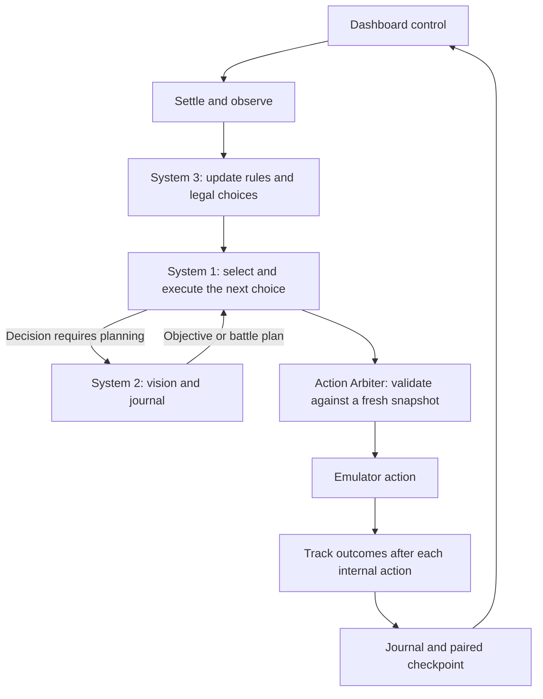

# Agentic Nuzlocke Runner

Autonomous **Pokémon Red-family Nuzlocke** runner using three systems: Jev plus deterministic controls, a vision planner, and a deterministic rules controller.

Emulation, REST API, and the **Field Log** dashboard come from [NousResearch/pokemon-agent](https://github.com/NousResearch/pokemon-agent) (PyBoy). This repo owns navigation, preparation, battle plans, rule enforcement, checkpoints, and run telemetry. The configured ROM is Red Star; legally obtained ROMs and run artifacts are gitignored.

- [AGENTS.md](AGENTS.md): operating instructions and emulator debugging notes.
- [Validation record](docs/validation.md): measured results and remaining acceptance work.
- [Original design](AGENT_READY_PLAN.md) and [proposal](PLAN.md): historical plans, with features beyond the current implementation.

## Scope

The current target is **fresh boot through the Boulder Badge**, using Bulbasaur, SET battle style, and audited Rare Candy preparation. `stop_after: brock` ends the loop when the badge is observed. Full-game completion is unverified; later milestones and level caps in configuration do not provide a complete route or team strategy.

## Setup and run

Requirements: Python **3.12+**, [uv](https://github.com/astral-sh/uv), a legally obtained Red/Blue-compatible `.gb` ROM, and credentials for the configured providers.

```bash
uv sync
export CURSOR_API_KEY=...  # System 2; JEV_API_KEY may be supplied in .env
uv run pytest -q
uv run nuzlocke run --rom /absolute/path/to/game.gb
```

Startup loads `.env` without overriding existing environment variables. The ROM can also be set with `NUZLOCKE_ROM` or `config/run.yaml` → `rom_path`. `pokemon-agent` is installed through the GitHub source in `pyproject.toml`; its files are under `.venv/lib/python3.*/site-packages/pokemon_agent/`.

On an open network leave `NUZLOCKE_RELAY` unset. Proxy routing is configured only when an existing proxy is present, or when `NUZLOCKE_RELAY=1` and the local relay is listening.

### Watch the game

Use the **Watch live** URL printed by the command. With the checked-in configuration it is [http://127.0.0.1:8766/dashboard](http://127.0.0.1:8766/dashboard), on the same port as the emulator API.

- Normal runs wait for dashboard **START**. **PAUSE** and **STOP** control the loop.
- Runs stop on a wipe, the configured Brock milestone, dashboard STOP, or a supplied `--max-steps` limit. The default `-1` removes the step limit.
- Sandbox loops start automatically and still honor PAUSE/STOP. Each private server has its own dashboard and shuts down when its command finishes.
- Cursor planner turns appear under **Agents → Filter → Source → SDK**.

The route dashboard is at **`http://127.0.0.1:<port>/navigation`** on the same server. It shows the live game, party types/HP, whole learned map, route, next waypoint, temporary blocked directions, and route reuse/replan counts. START/PAUSE/STOP and a link to the original Field Log are included. New servers correct the upstream Bug/Ghost and Psychic/Ice type-ID mappings, including Beedrill’s Bug/Poison display.

To watch multiple private runs, start one command per terminal with a distinct unused port, then open each printed dashboard URL:

```bash
uv run nuzlocke sandbox --port 8801 --steps 1500
# In another terminal:
uv run nuzlocke sandbox --port 8802 --steps 1500
```

These loops make real provider calls. Viewing a dashboard does not advance the emulator; frames advance through `/action` only.

## The three systems

| System | Responsibility | Main implementation |
|---|---|---|
| **1 — execution** | Jev chooses among legal goals, menu rows, battle commands, and moves. Code handles paths, cursor movement, dialog, and preparation menus. | `agents/system1.py`, `goals.py`, `navigation.py`, `battle.py`, `preparation.py` |
| **2 — planning** | A Cursor vision director reads the screenshot and journal on decision triggers, sets objectives, and creates or refreshes trainer battle plans. | `agents/roles.py`, `prompts.py`, `orchestration/loop.py` |
| **3 — rules** | Tracks encounters, permanent deaths, battle eligibility, healing, storage, and preparation. Supplies constraints and forced choices. | `agents/system3.py`, `policy.py`, `referee/`, `orchestration/ledger.py` |



System 3 determines rule constraints before decisions. Fixed preparation menus run without an LLM call. System 1 handles ordinary play; System 2's explicit steps are used when System 1 cannot act or would request another look. All button proposals pass through the arbiter.

### Navigation and planning

- Code objectives cover the bedroom, verified Bulbasaur selection, Oak's Parcel, ball shopping, Viridian Forest, Pewter preparation, and Brock. Healing and dead-party storage can override the story.
- Encounter searches cover Route 1, Route 2, and Viridian Forest. They favor less-visited reachable grass and have a persisted budget of 100 search cycles per area. Exhausting that budget resumes the story without consuming an encounter slot.
- System 1 builds paths over the remembered map with Dijkstra paths (unit costs give shortest walks) and sends bursts of up to eight walks. Non-target warps and NPCs block paths; confirmed failed walks temporarily block a direction for six cycles. Indoor return-map destinations and separate doors to the same map are handled explicitly.
- Safe routing penalizes observed grass; encounter searches and urgent poison healing use step distance. Unreachable or unobserved System 2 waypoints are rejected.
- Grid and object data are checked against actual movement. Contradictions withhold them; corroborating movement can restore trust. Battle and scripted transitions are excluded from object-trust strikes.
- System 2 sees journal entries since its last look and the whole learned map, with unknown terrain marked explicitly. It can return a typed `route_plan` with a matching map/objective, up to eight reachable waypoints, and a safe/shortest preference. Valid routes persist across cycles and checkpoints; subsequent verified segments execute without another Jev choice. Overworld refreshes have an eight-cycle cooldown; a usable code objective can continue despite Jev uncertainty. Failed paths still escalate.
- Trainer plans carry `opening_moves`, ordered `moves`, `switch_to`, and `switch_below`. Plans refresh when the active Pokémon, opponent, status, critical HP, usable moves, or eligible roster changes. An opener is consumed when its PP actually decreases.

### Rules and preparation

| Rule | Current behavior |
|---|---|
| Starter and style | Check the displayed species before accepting Bulbasaur; configure SET through the restricted preparation endpoint. |
| Encounters | First eligible wild encounter per numeric map ID after balls have ever been acquired. That activation stays latched even if the bag later runs out. Outcomes become caught or forfeited and cannot be replaced. |
| Duplicates | Reroll any ever-owned evolution family, including families whose Pokémon have died. |
| Nicknames | Optional; the automated prompt answer is NO. |
| Death | HP zero creates a permanent death attached to a capture identity. Healing, evolution, and party reordering do not revive it. Dead Pokémon are excluded from battle choices and deposited using Center PC menus. |
| Level cap | Freeze eligible party members at battle entry. Levels earned during that battle are allowed; over-cap Pokémon cannot be selected for later battles until eligible again. Brock's cap is 14. |
| Items | Poké Balls for legal wild captures; no trainer battle items. Audited Rare Candies are allowed outside battle. Other healing is at Centers or Mom. |
| Wild battles | Flee duplicates, non-capture encounters when candy preparation is enabled, or when the active Pokémon is below 25% HP. Catching uses the ball row without asking Jev. |
| Healing | Seek healing for any living member below half HP, status problems, or all moves exhausted. Restore full HP, status, and observed PP before Brock, including after the gym's junior trainer. |
| Wipe | Detect all party members dead/fainted, a battle-loss signal, or the healed blackout warp; stop further play. |

Preparation targets are configured under `rare_candy` in `config/run.yaml`:

| Location | Target | Conditions |
|---|---|---|
| Oak's Lab | 8 | Lone Bulbasaur before the rival; full HP and healthy status. |
| Viridian Center | 12 | Healthy party, no permanently dead members. |
| Pewter Center | 14 | Healthy party, no permanently dead members. |

The restricted endpoint grants the exact missing candy quantity, accounting for candies already held. The runner consumes them through the normal bag and party menus; it never writes levels directly. Grants and observed uses enter the rule-event chain. Targets are limited by the current cap and endpoint limits (8 in the lab, 14 at the supported Centers).

Active battle Pokémon and PP come from the battle structure. Move options include observed types, Gen-1 effectiveness, and PP; this is not a damage calculator. Battle damage calculations are deferred to a later commit. Known trainer teams are vanilla Red data through Misty and may differ in Red Star.

### Observation and timing

`GET /snapshot` reads native screenshot, state, collision grid, map objects, and frame count under one lock without advancing frames. Each internal action, including waits and dialog paging, feeds rule tracking. Every decision cycle settles the emulator before reading the current snapshot; cached action results cannot skip transition settling. The arbiter rechecks choices against a fresh snapshot. Walk bursts stop on HP/status changes, dialogs, prompts, battles, map transitions, and immobile walks.

The default `vision_only: true` omits raw RAM JSON from vision prompts. The planner still receives the journal, objectives, and rule briefing. System 1 and deterministic controllers use decoded visible text, party/battle data, and checked map tables. `--with-ram` enables the alternate prompt path.

Pixel checks use native **160×144** frames. Vision calls use the **640×576** grid overlay with A1–J9 labels. Readiness uses screen content and measured movement/cutscene signals; unreliable RAM dialog flags do not decide whether a menu or dialog is ready.

- One `walk_*` press moves one tile from any facing; walking into a wall can turn the player.
- `skip_dialog` sends up to six rounds of `hold_b_30` plus released `wait_30`, stopping at menus, prompts, closed text, or a stable frame. B at YES/NO answers NO.
- Battle narration that stalls after B and level-up stat boxes use A; evolution screens wait without B.
- `settle()` advances animations with explicit wait actions. Wall-clock sleeps only pace the viewer.
- Defaults: `prompt_interval_s: 0.1`, `press_interval_s: 0.1`, `max_actions_per_proposal: 12`. Logical walk macros expand into individual presses.

## Checkpoints and legal continuation

```bash
uv run nuzlocke run --resume <run-id>
```

Each completed cycle writes an immutable savestate and controller record, then atomically publishes `checkpoints/current.json`. Controller state includes the encounter/death ledgers, battle eligibility and plans, navigation memory/trust, and preparation/search state. Mid-battle commits are supported. `savestates/auto.state` is a convenience copy for diagnostics.

Resume validates ROM/rules identity, savestate checksum, and the chained rule-event history against its stored head. A pending-action marker, missing paired history, changed identity, corrupted history, or a terminal wipe refuses legal continuation. A crash during an action therefore may require diagnostic inspection instead of automatic resume.

`checkpoint.every_steps` and `checkpoint.enabled` remain legacy configuration fields; the active paired-commit path runs every completed cycle regardless of those values. Old unpaired states can be inspected with `sandbox --from`.

Servers launched by the adapter require an owner token for action, load, new-game, and preparation requests; competing writers receive HTTP 409. Read-only views and dashboard control remain available. This protects controller ownership, while the event chain detects inconsistent local history; it is not an external tamper-proof audit.

## Sandbox and acceptance

```bash
# Diagnostic replay from an existing run; private emulator and copied state
uv run nuzlocke sandbox --from <run-id> --steps 30

# Deterministic button probe, no LLM
uv run nuzlocke sandbox --from <run-id> --script "skip_dialog walk_down*2 wait_30"

# Choose an immutable saved state by name
uv run nuzlocke sandbox --from <run-id> --state commit-00000050 --steps 30

# Five sequential fresh runs through Brock
uv run nuzlocke benchmark --trials 5 --steps 1500 --output runs/brock-acceptance.json
```

Sandboxes use a new `runs/sandbox-<time>-<hex>/` directory and the first free port from 8791 unless `--port` is supplied. They do not change the source run or restart its server. Matching controller history is copied when available; legacy source states start with an empty controller. Source-state replays are diagnostics, not legal continuations or fresh acceptance trials.

Script probes write `probe.jsonl` and `frames/`; loop mode writes `summary.json`, `journal.jsonl`, events, and checkpoints. The benchmark retains every failed trial and exits nonzero if its aggregate `passed` value is false.

The current automated pass predicate requires every requested trial to complete Brock, without a wipe, exception, or rule alert. Inspect `policy_rejections`, deaths, and event-chain integrity as well when reviewing acceptance. `eligibility_alerts` describe Pokémon unavailable for future battles; they do not by themselves establish an illegal action. The summarizer classifies older outside-battle `rule_violation` events as eligibility notices, so raw event review remains useful.

## Configuration and artifacts

| File | Purpose |
|---|---|
| `config/run.yaml` | ROM/API port, cadence, vision mode, OptMem, candy targets, `stop_after`. |
| `config/rules_red.yaml` | Clauses and level caps; hashed for checkpoint identity. Some declarative fields, such as the shiny clause, have no dedicated runtime handler. |
| `config/agents.yaml` | Provider and models. Default `dual`: planner `grok-4.7`, Jev `jev-latest`. Edit `planner.model` and `planner.params` for System 2. |

`provider: cursor` uses the configured Cursor model for role calls. `openai_compatible` supports text-only endpoints; screenshot paths in prompts are not uploaded as images. Cursor keeps a durable agent and compacts it at the configured token threshold.

OptMem is off by default; enable `memory.enabled` or `NUZLOCKE_MEMORY=1` for landmarks and periodic rollups. Short-term planning uses the journal. The walkthrough skill is copied into the run workspace, with relevant excerpts injected into planner prompts.

| Artifact under `runs/<run-id>/` | Contents |
|---|---|
| `manifest.json` | Run configuration and provider metadata. |
| `events.jsonl`, `run.sqlite` | Events; ledger commits, candy grants/uses, wipes, and milestones carry a hash chain. |
| `journal.jsonl` | Per-cycle goal, buttons, outcome, and text for System 2. |
| `checkpoints/current.json`, `checkpoints/commit-*.json` | Latest paired controller record and immutable history. |
| `savestates/commit-*.state`, `savestates/auto.state` | Immutable emulator states and convenience copy. |
| `summary.json` | Sandbox/benchmark outcomes, planner latency, trigger counts, Jev confidence/latency, and navigation metrics. |
| `memory/notes.log` | OptMem notes when enabled. |

Provider transcripts also live outside the repo under Cursor's project agent-transcript directory; deleting a run directory does not remove them. Per-cycle states accumulate without automatic pruning.

## Development and limits

```bash
uv run pytest -q
uv run nuzlocke --help
uv run nuzlocke benchmark --help
```

Tests cover menu/battle selection, navigation trust, duplicates and permanent deaths, caps, policy enforcement, preparation guards, snapshots, checkpoint integrity, and telemetry. Emulator probes are still needed for movement, transition, and dialog claims. See [validation](docs/validation.md) for the tested state.

Remaining work includes repeatability and navigation efficiency around Forest/Route 2 transitions, broader team/box management, a generation-aware damage calculator, full-game routing, and a FireRed adapter. Capture identities use evolution family and trainer identity rather than a universal unique ROM identifier; unusual same-family duplicates can be ambiguous. The supported automated flow leaves nicknames off. Configuration changes alone do not implement every clause or extend the tested route.

Key code: `nuzlocke/agents/` (systems, policy, execution), `environment/` (emulator adapter/server), `orchestration/` (loop, arbiter, ledger, checkpoint, sandbox), `referee/` (rules, families, type chart), `state/` (contracts/events), and `apps/orchestrator/main.py` (CLI).
